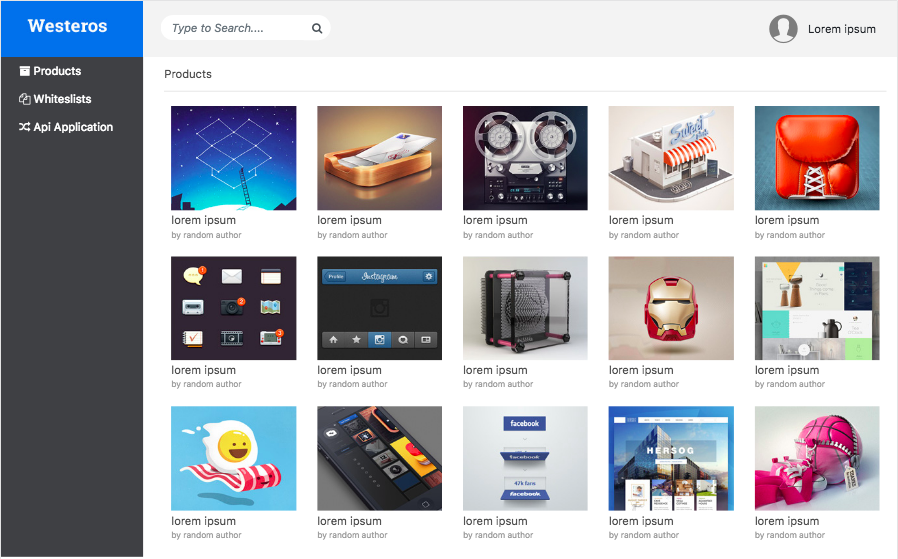
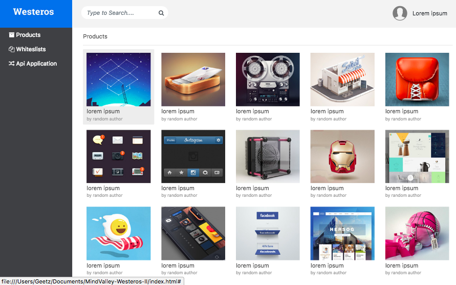
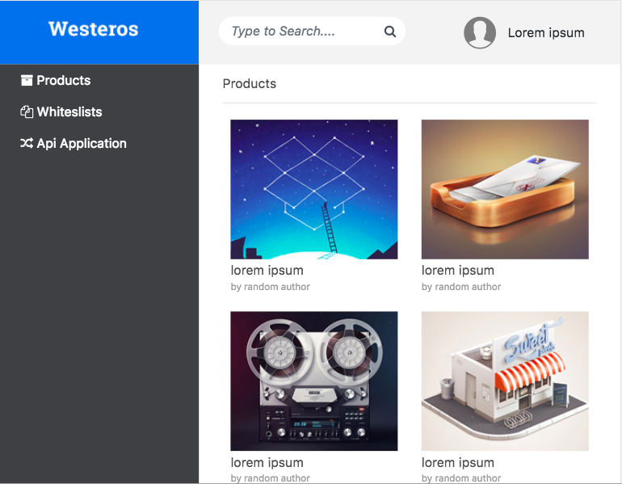
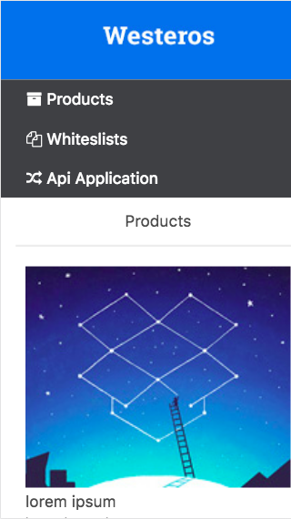

# MindValley-Westeros-II
<b>Task:-</b> To design a Westeros web application as a part of Mind Valley assessment using <b>Bootstrap</b>.

<b>Setps to open the web page on browser?</b>
1. Clone the current repository at any specific location on your computer.
2. Open the <b>index.html</b> page using any browser of your choice.

<b> Front-end library used: </b> Bootstrap

<b>Screenshots</b> are attached here:

<b>A. Desktop View (Without Product Highlight)</b> 
 
<b>B. Desktop View (With Product Highlight)</b> 
 
<b>C. Tablet View</b> 
 
<b>D. Mobile View</b> 
 
